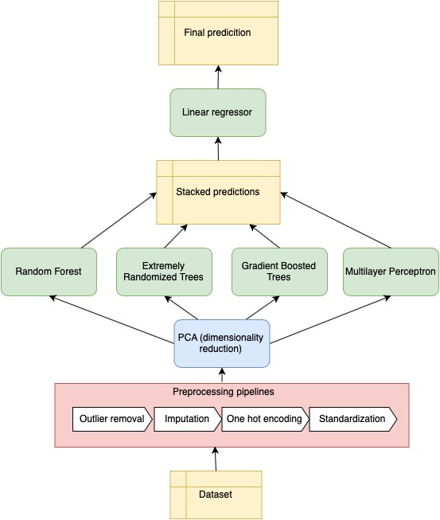

## House Prices Advanced Regression Techniques Kaggle Competition

This project runs a Machine Learning ensemble model to predict house sale prices in Ames, Iowa. You can find the dataset 
[here](https://www.kaggle.com/c/house-prices-advanced-regression-techniques/data). If you have `kaggle` installed you can simply run:

```bash
kaggle competitions download -c house-prices-advanced-regression-techniques
```

To clone the project use:
```bash
git clone https://github.com/RezaSoleymanifar/House-Prices-Advanced-Regression-Techniques-Kaggle-Competition..git
```

This project is run entirely on [scikit-learn](https://scikit-learn.org/stable/). To install required packages run:

```bash
pip install -r requirements.txt
```

- Start training.

```bash
python train.py 'train_csv_file_path'
```

Note this replaces the pretrained pipeline `pipeline_full.pkl`. Training and cross-validation is parallelized between all CPU cores. This can take several minutes depending on your system.

- Start evaluation. 

<!--([pretrained model](https://github.com/tensorlayer/srgan/releases/tag/1.2.0) for DIV2K)-->

```bash
python predict.py 'test_csv_file_path' 
```

This will generate a `predictions.csv` file in current directory and prints the resulting RMSLE.

### Model Description

We use a stacking ensemble of random forest, extremely randomized trees, gradient boosted trees and a multilayer perceptron to predict the sales prices of homes in the dataset. The figure bellow can further explain how the model works. Data is initially passed through preprocessing pipelines that handle imputation of missing values, encoding categorical features and finally standardization of all features.

Features are then projected onto a lower dimensional space using PCA and data is fed into above
mentioned models. Each model generates its predicted labels and finally a linear regressor is trained to map these predictions onto the final labels. This practice--training a model on top of an ensemble, to aggregate the results of base models--is known as stacking.

<!--- <a href="http://tensorlayer.readthedocs.io">--->
<div align="center">
	
</div>
</a>

__Results__: This model able to achieve a combined final RMSLE of 0.1141 on test dataset.

### Data Description


- SalePrice - the property's sale price in dollars. This is the target variable that you're trying to predict.
- MSSubClass: The building class
- MSZoning: The general zoning classification
- LotFrontage: Linear feet of street connected to property
- LotArea: Lot size in square feet
- Street: Type of road access
- Alley: Type of alley access
- LotShape: General shape of property
- LandContour: Flatness of the property
- Utilities: Type of utilities available
- LotConfig: Lot configuration
- LandSlope: Slope of property
- Neighborhood: Physical locations within Ames city limits
- Condition1: Proximity to main road or railroad
- Condition2: Proximity to main road or railroad (if a second is present)
- BldgType: Type of dwelling
- HouseStyle: Style of dwelling
- OverallQual: Overall material and finish quality
- OverallCond: Overall condition rating
- YearBuilt: Original construction date
- YearRemodAdd: Remodel date
- RoofStyle: Type of roof
- RoofMatl: Roof material
- Exterior1st: Exterior covering on house
- Exterior2nd: Exterior covering on house (if more than one material)
- MasVnrType: Masonry veneer type
- MasVnrArea: Masonry veneer area in square feet
- ExterQual: Exterior material quality
- ExterCond: Present condition of the material on the exterior
- Foundation: Type of foundation
- BsmtQual: Height of the basement
- BsmtCond: General condition of the basement
- BsmtExposure: Walkout or garden level basement walls
- BsmtFinType1: Quality of basement finished area
- BsmtFinSF1: Type 1 finished square feet
- BsmtFinType2: Quality of second finished area (if present)
- BsmtFinSF2: Type 2 finished square feet
- BsmtUnfSF: Unfinished square feet of basement area
- TotalBsmtSF: Total square feet of basement area
- Heating: Type of heating
- HeatingQC: Heating quality and condition
- CentralAir: Central air conditioning
- Electrical: Electrical system
- 1stFlrSF: First Floor square feet
- 2ndFlrSF: Second floor square feet
- LowQualFinSF: Low quality finished square feet (all floors)
- GrLivArea: Above grade (ground) living area square feet
- BsmtFullBath: Basement full bathrooms
- BsmtHalfBath: Basement half bathrooms
- FullBath: Full bathrooms above grade
- HalfBath: Half baths above grade
- Bedroom: Number of bedrooms above basement level
- Kitchen: Number of kitchens
- KitchenQual: Kitchen quality
- TotRmsAbvGrd: Total rooms above grade (does not include bathrooms)
- Functional: Home functionality rating
- Fireplaces: Number of fireplaces
- FireplaceQu: Fireplace quality
- GarageType: Garage location
- GarageYrBlt: Year garage was built
- GarageFinish: Interior finish of the garage
- GarageCars: Size of garage in car capacity
- GarageArea: Size of garage in square feet
- GarageQual: Garage quality
- GarageCond: Garage condition
- PavedDrive: Paved driveway
- WoodDeckSF: Wood deck area in square feet
- OpenPorchSF: Open porch area in square feet
- EnclosedPorch: Enclosed porch area in square feet
- 3SsnPorch: Three season porch area in square feet
- ScreenPorch: Screen porch area in square feet
- PoolArea: Pool area in square feet
- PoolQC: Pool quality
- Fence: Fence quality
- MiscFeature: Miscellaneous feature not covered in other categories
- MiscVal: $Value of miscellaneous feature
- MoSold: Month Sold
- YrSold: Year Sold
- SaleType: Type of sale
- SaleCondition: Condition of sale

